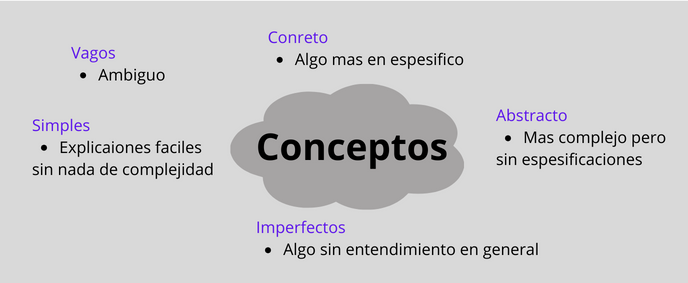

### Logica Propocicional

Cuando tomamos algo y lo comparamos con algo y lo decimos que es igual o distinto, estamos utilizando la lógica proposicional. Cuando estamos en nuestra zona de confort y nos sacan por ende no tenemos algo conocido en lo que podamos comparar nos sentimos ansiocos

Nuestro lenguaje corporarl puede transmitir nuestro sentir y pensar, por ejemmplo si estamos parados y rijidos cuando explicamos algo da a entender y se transmite que estamos nerviosos y no entendemos lo que xplicamos por el contrario si nos mostramos con soltura al explicar algo y se hace notar que dominamos el tema.

### Introducción a la lógica proposicional

La **lógica proposicional** es una rama de las matemáticas de la lógica que se ocupa del estudio de los sistemas formados por afirmaciones o negativas, se ocupa del estudio de los sistemas formulados por medio de afirmaciones o negocios por la lógica.

### Conceptos

#### ¿Como nos expresamos los seres humanos?

El lenguaje natural es muy rico, redundante y ambiguo por su relacion intriseca entre la interpretación emisor-receptos y el referente de mensaje

#

Existen en la realidad un numero conciderable de problemas con los que una persona se enfrenta y de los cuales se deben ~~deducir~~ ciertos datos para resolverlos.

Una deduccion, un razonamiento o inferiencia es un tipo de pensamiento que se basa en la conclucion a partir de un conocimiento nuevo.

- Utilizando **palabras**: son el medio principal de comunicación entre los humanos
- Utilizamos un lenguaje común para hablar de cosas que ocurrir el mundo, pero no es una representación formal del conocimiento para transmitir ideas y conceptos.

**Proposiciones**: son afirmaciones o negativas de una afirma

**Lenguaje Natural:** Frases y conjunciones

- Si se desea deducir infromacion a partir de nuestro lenguje cotidiano formado de frasses o expreciones, es necesario poder evaluarlas para que se utilizan en nuestra vida cotidiana para comunicarnos.

La misma info se puede transmitor a travez de ~~**_Difrentes construcciones gramaticales._**~~

Gramaticalemnete las fases se pueden transmitir:

1. Afirmativa (Afirmar algo): Es decir, es verdadero lo que dice la propuesta.
2. Negativa (negar allgo): Es decir, es falso lo que dice la propuesta.

#

    Ejemplo

    1.  Todos los snark son bojum
    2.  Rufus es un snark
    3.  Por tanto Rufus es bojum.

#

1. ¿Que?
2. ¿Cuando?
3. ¿Quien?
4. ¿Como?
5. ¿Donde?
6. ¿Por qué?

Como ingenieros debemos plantearnos esas preguntas al resolver un problema
