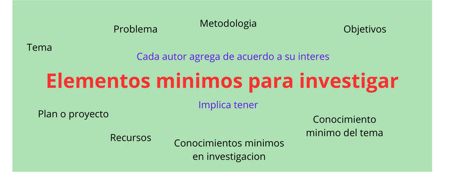
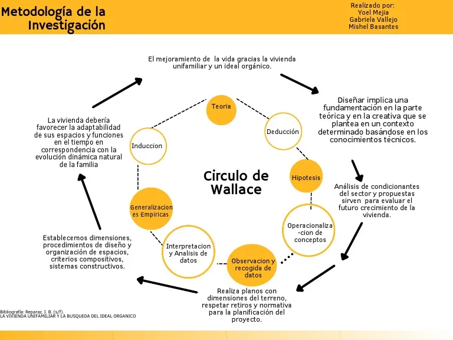
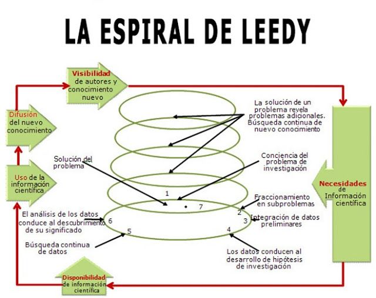

### ¿Que es la investigación?

Investigación es el proceso de adquirir conocimientos, información, saber, técnicas, habilidades, etc., mediante el estudio, observación, análisis. se investiga para aprender algo.

Es conciderada una actividad orientada a la o btencion de nuevos conocimientos y su aplicación para la solucion de problemas o interrogantes de caracter general y/o cientifico.

### Investigacion no experimiental

- **Definición**: Es aquella que no se basa en la realización de experimentos, sino que busca conocer y comprender el mundo a través del análisis de los datos o de la informacion. La investigación no experimental se refiere a aquella que busca conocer el mundo a través de análisis y reflexión sobre conceptos, fenómenos o situaciones.

  Se basa fundamental mente en la observacion de fenomenos, tal y como se dan en su entorno natural, para analizarlos con postrioridad. Se realiza sin manipular variable

### Investigacion experimental

- **Definición**: Consiste en manipular la condicion (causa) de una o mas variables con el objetivo de evaluar de una manera controlada los resultados y efectos en un momento o situacion determinada (efecto).

#

    La investigacion experimental es cuantitativa a diferencia de la no experimental que es cualitativa

#

### Modelo cientifico de investigacion

Es una guia que garantiza de manera precisa la informacion, es una representacion abstracta, conceptual, grafica o visual. Que apoya el analisis, la descripcion, la explicacion y la simulacion de fenomenos o precesos

Cuando decimos que es algo abstracto es una idea vaga que no espefificamente es qye vaya a dar la solucion del problema. Damos a conocer una idea, una forma de pensar se vuelve un tema de analisisi subjetivo

    Abstracta: Es la representacion mental de una idea, objeto, etc.

#

#

### Representaciones graficas

Representan un dato o informacion de manera ordenada. Esto se logra a traves de:

- Diagramas: son herramientas visuales para mostrar relaciones entre diferentes elementos.
- Tablas: muestran datos clasificados en filas y columnas.
- Gráficos: utilizan formas geométricas para mostrar información numérica.

#

## La rueda de Wallace

Presenta los principales componentes, controles metodologicos y transformaciones en el proceso de infromacion en el proceso de contruccion de conocimiento.

- Los commponentes basicos de informacion enmarcados en rectangulos.
- Los controles metodologicos aparecen enmarcados en ovalos.
- Las transformaciones de informacion están representadas por flechas.

#

## La espriral de Leedy

El modelo de leedy espesifica que el proceso de investigacion tiene una naturaleza circular. EL ciculo de investigacion se puede describir más adecuadamente como una hélice o espiral de investigación. La investigacián es un proceso circular continuo que constituye una capa o etapa dobre otra.

#
